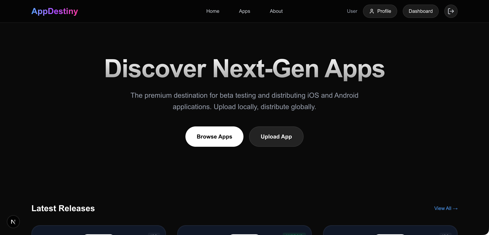
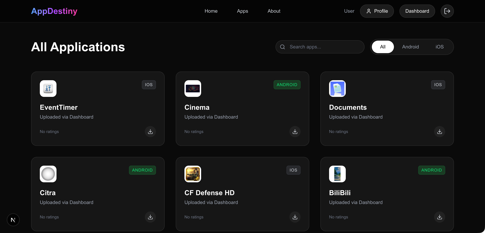
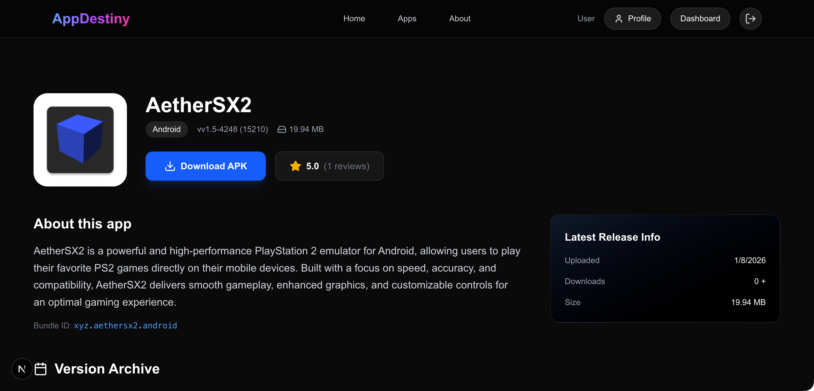
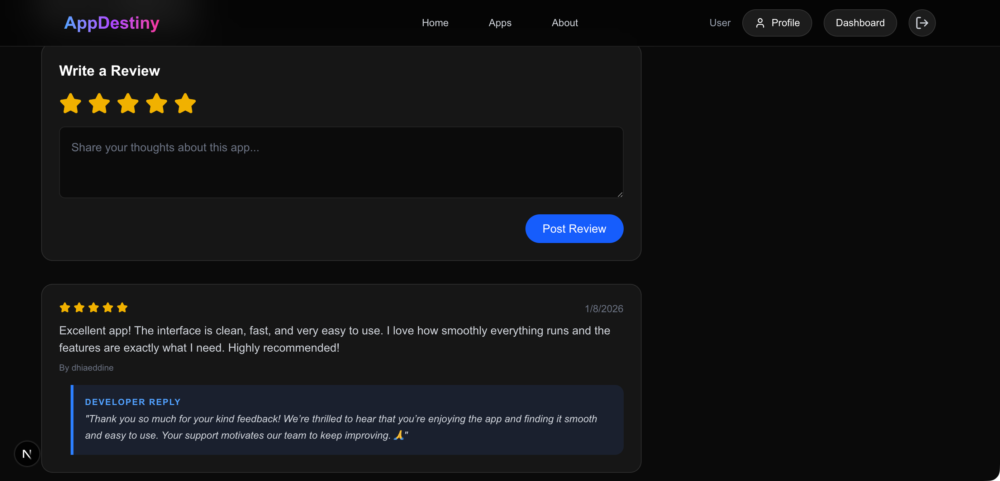
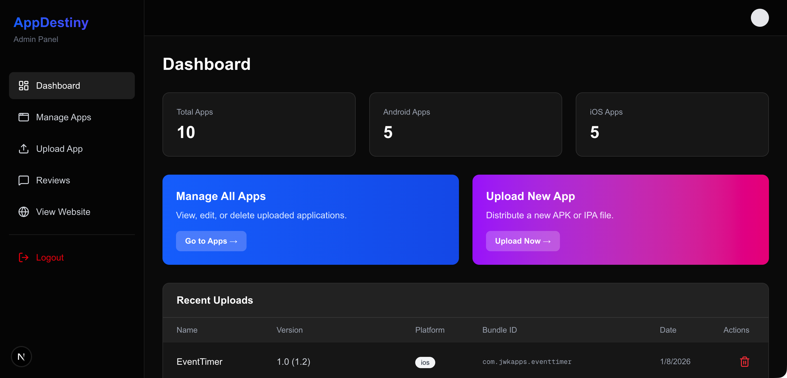
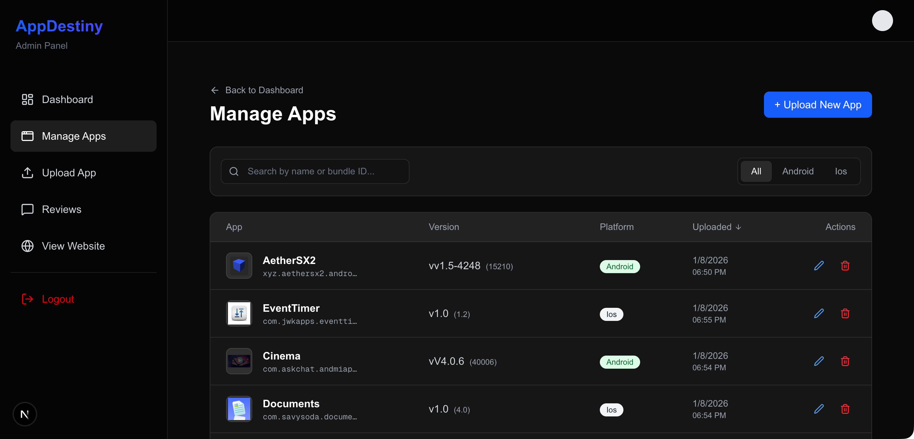

# App Destiny

A modern, high-performance platform for distributing iOS (IPA) and Android (APK) applications. Built with Next.js, Drizzle ORM, and Supabase.



## ✨ Features

- **Unified Distribution**: Host and distribute both iOS and Android apps from a single portal.
- **Smart Parsing**: Automatically extracts app name, version, build number, and icons from uploaded APK/IPA files.
- **Download Tracking**: Accurate, unique download counting per user/guest.
- **Review System**: Users can rate and review apps; Admins can reply directly.
- **Admin Dashboard**: Comprehensive dashboard to manage uploads, view stats, and delete versions.
- **Mobile Responsive**: Fully optimized UI for desktop and mobile devices.

## 📸 Gallery







## 🛠️ Tech Stack

- **Framework**: [Next.js 15](https://nextjs.org/) (App Router)
- **Database**: [PostgreSQL](https://www.postgresql.org/)
- **ORM**: [Drizzle ORM](https://orm.drizzle.team/)
- **Auth & Storage**: [Supabase](https://supabase.com/)
- **Styling**: [Tailwind CSS](https://tailwindcss.com/)
- **UI Components**: [Lucide React](https://lucide.dev/)

## 🚀 Quick Start (Docker Compose)

The easiest way to run App Destiny is using Docker Compose. This will build the application from source and set up the database.

1. Create a `docker-compose.yml` (or use the one provided in the repo).

2. Run the application:
   ```bash
   docker-compose up --build
   ```

3. Open [http://localhost:3000](http://localhost:3000).

## 🔑 Initial Admin Access

The application comes with a pre-configured admin account for initial setup.

### 1. Default Login
Navigate to `/login` and use the main login form.

*   **Email**: `admin@example.com`
*   **Password**: `admin`
*   *(Credentials can be changed via `ADMIN_EMAIL` and `ADMIN_PASSWORD` environment variables)*

> **Note**: "Sign Up" is disabled by default until configured. You must use the admin account.

### 2. Session Persistence
*   **Standard Login**: Session expires in **1 hour** (auto-extends while active).
*   **Remember Me**: Check the box to stay logged in for **30 days**.

> **Note**: This local auth system is fully secure, using `bcrypt` for password hashing and signed `JWT` cookies.

## ⚡ Supabase Setup (Production)

If you are using Supabase for authentication, you need to manually assign the `admin` role to your user to access the dashboard. You have two options:

### Option 1: Via Dashboard (JSON)
1.  **Sign Up** normally in your deployed app.
2.  Go to **Supabase Dashboard** -> **Authentication** -> **Users**.
3.  Click the context menu (three dots) next to your user -> **Edit User**.
4.  Add the following JSON to the **User Metadata** field:
    ```json
    {
      "role": "admin"
    }
    ```
5.  **Save User**. Log out and log back in.

### Option 2: Via SQL Command
Run this command in the **Supabase SQL Editor**:

```sql
UPDATE auth.users
SET raw_user_meta_data = raw_user_meta_data || '{"role": "admin"}'::jsonb
WHERE email = 'your-email@example.com';
```

## 🛠️ Development Setup (Source Code)

1.  **Install Dependencies**:
    ```bash
    npm install
    ```

2.  **Run Development Server** (Hot Reload):
    ```bash
    npm run dev
    # Runs on http://localhost:3000
    ```

3.  **Run Production Locally**:
    ```bash
    npm run build
    npm start
    # Runs optimized build on http://localhost:3000
    ```

## 🤝 Contributing

### Project Structure

- `/app`: Next.js App Router pages and API routes.
- `/components`: Reusable UI components.
- `/lib`: Utilities (DB connection, parser logic, Supabase client).
- `/lib/db/schema.ts`: Drizzle ORM database schema definitions.
- `/public/uploads`: Default local storage for app files.

## 📄 License

This project is licensed under the MIT License.
